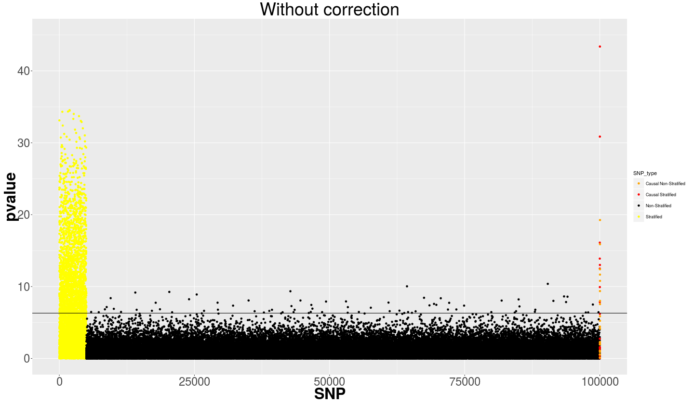
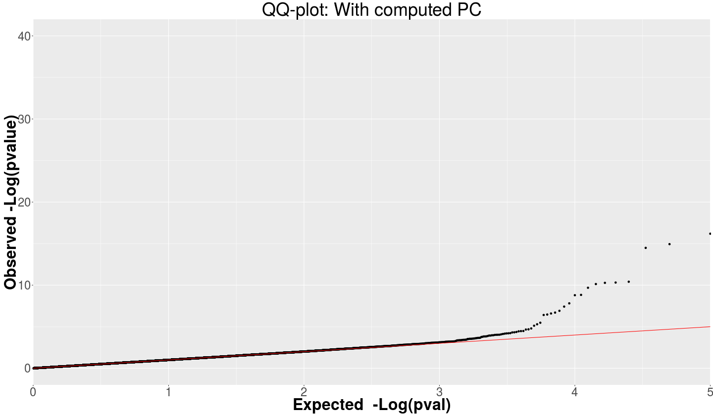
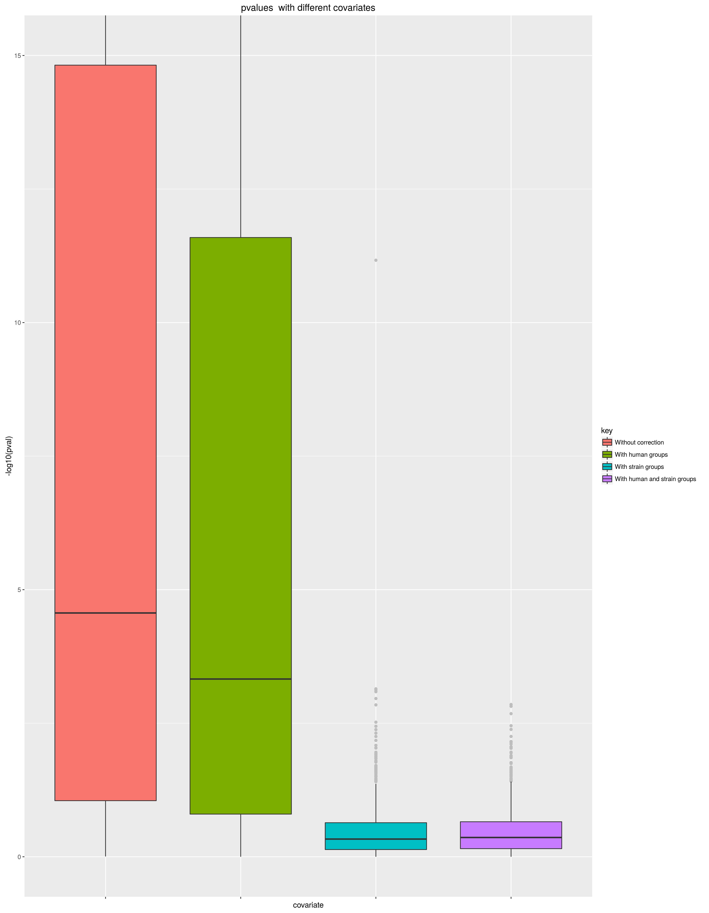
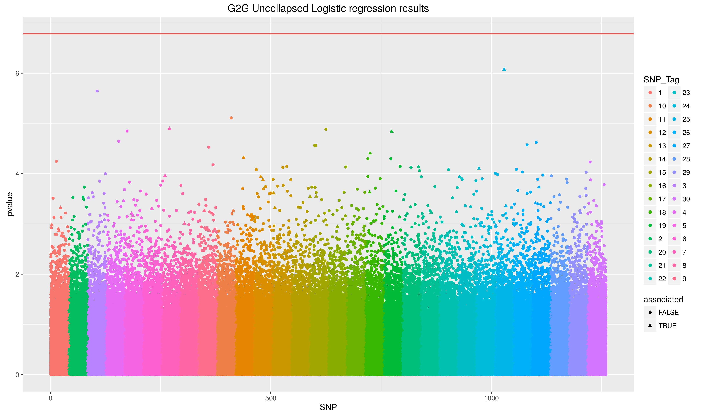
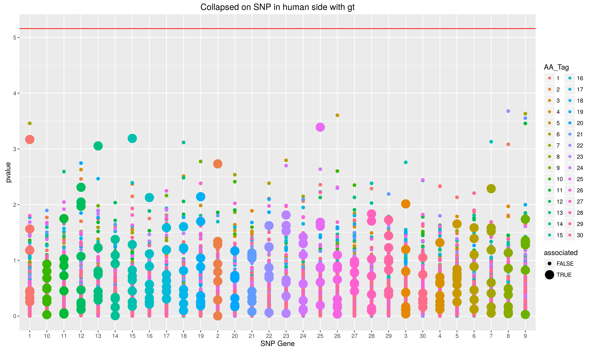
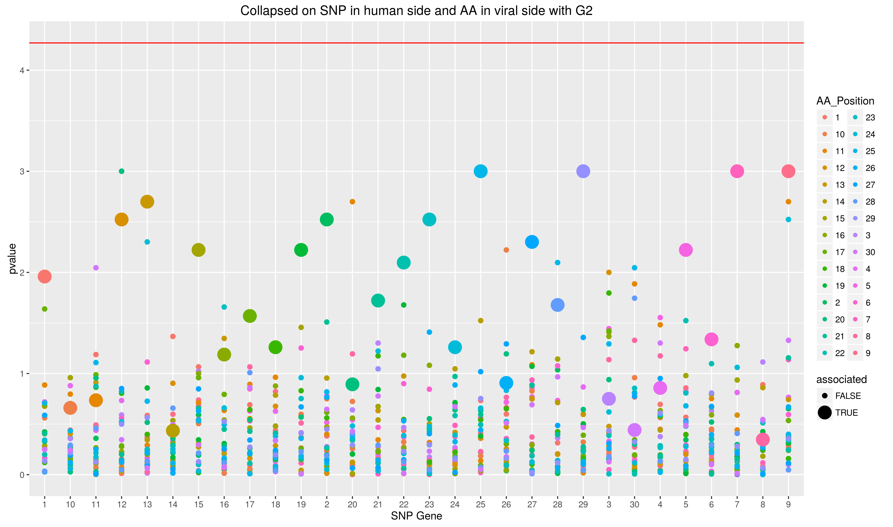
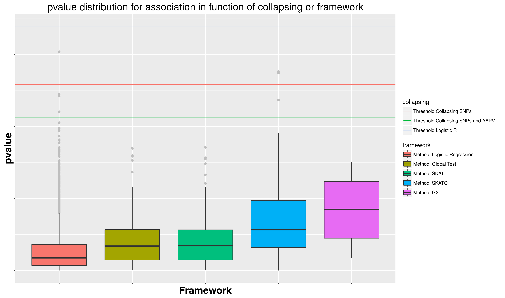

# Introduction
This tool has been developed to simulate*G2G* analysis.  

G2G or genome-to-genome analysis is a joint analysis of host and pathogen genomes, that study side by side correlation between host and pathogen systematic variation.  

# Load tool

```R
source("src/G2G_simulator.R")
```

# Simulate GWAS Case-Control Study

#### Setup the study
First you need to generate a population structure.  
Here there is two human groups P1 and P2.  
P1 is distributed like 200 individuals are in case group and 400 in control group.  
P2 is distributed like 400 individuals are in case group and 200 in control group.  

```R
my_population = generate_population_for_GWAS(list(
	`P1` = c(`case` = 200, `control` = 400), 
	`P2` = c(`case` = 400, `control`  = 200)))
```

#### Run the GWAS analysis
Number of neutral SNP is  100000  
On this 5% will be stratified  
20 non stratified causal SNP will be added with R coefficient between 1 and 2  
20 stratified causal SNP will be added with R coefficient between 1 and 2   
Fixation coefficient for making stratification strength is 0.2  

```R
GWAS_result = GWAS_scenario(populations = my_population, 
											 neutral = 100000, 
											 neutral_S_rate = 0.05, 
											 causal_NS = seq(1,2, by = 0.05), 
											 causal_S = seq(1,2, by = 0.05), 
											 fst_strat = 0.2)
```

#### Exploit results
GWAS_result is a list containing different trace of the execution  

Plot the results with 3 different conditions :
* Without correction
* With human groups
* With 5 first PCs

On Manhattan plots

```R
plot_GWAS_manhattan(GWAS_result)
```




On QQ plotes

```R
plot_GWAS_QQ(GWAS_result)
```



# Simulate G2G setup

#### Setup the study design
Describe your study design in terms of population and strain distribution.  
Population P1 and P2 has the same amount of sample (2500 each) but in P1 1500 samples has strain A and 1000 has strain B and conversely in P2.  

```R
study_design = to_study_design(list(
	`P1` = c(`A` = 1500, `B` = 1000), 
	`P2` = c(`A` = 1000, `B`  = 1500)))
```

#### Setup the the G2G pattern

**rep** is the number of repetition you want to execute to draw the pvalue distribution.  

**s_stratified** is the stratification you want to set in **S**NP on **human population**. The order give the stratification gradient.  
> eg : here there will be more alternate allele in population P1 than population P2.

**s_biased** is the biased you want to set in **S**NP in function of **pathogen population**. The order give the bias gradient.  
> eg : Here there will be more alternate allele in sample that has strain A than strain B. 

**s_partial_bias** if the biased you set in **S**NP occurs in a specific **human population**. It require s_biased to be defined.  
> eg : Here the bias between strain A and B will occurs only in population P1.

**s_partial_strat** if the stratification you set in **S**NP occurs in a specific **pathogen population** It require s_stratified to be defined.  

Similarly with viral side...  
**a_stratified** is the stratification you want to set in **A**AVP on pathogen population. The order give the stratification gradient. >here there will be more alternate amino acid in strain A than in strain B.  

**a_biased** is the bias you want to set in **A**AVP in function of human population. The order give the bias gradient.  

**a_partial_strat** if the stratification you set in **A**AVP occurs in a specific **human population**. It require a_stratified to be defined.  

**a_partial_bias** if the biased you set in **A**AVP occurs in a specific **pathogen population**. It require a_biased to be defined.  

**associated_strains** in case of association this is pathogen population associated (if omitted all strained are associated)  

**associated_populations** in case of association this is the human population associated (if omitted all strained are associated)  

```R
G2G_setup = get_G2G_setup(rep = 1000, s_stratified = c("P1","P2"), s_biased = c("A","B"), s_partial_bias = c("P1"), a_stratified = c("A","B"))
```

#### Run G2G Setup
**fst_pop_strat** is the fixation coefficient that define strength for human population stratification (must be set if s_stratified is defined in scenario)

**fst_pop_bias** is the fixation coefficient that define bias for human population bias (must be set if s_biased is defined in scenario)

**fst_strain_strat** is the fixation coefficient that define strength for pathogen population stratification (must be set if a_stratified is defined in scenario)

**fst_strain_bias** is the fixation coefficient that define bias for pathogen population bias (must be set if a_biased is defined in scenario)

**beta** if there is association set the log of odd ratio

```R
test_G2G_setup(study_design, G2G_setup, fst_pop_strat = 0.2, fst_pop_bias = 0.2, fst_strain_strat = 0.2)
```

The results are automatically plot. There is too type of it at different scale. With pvalues, and with pvalues difference relative to particular correction.  



# Simulate G2G study

#### Define you data

Similarly to G2G setup simulation, define study design in term of population and strain distribution  
```R
study_design =  to_study_design(list(`P1` = c(`A` = 250, `B` = 250), `P2` = c(`A` = 250, `B`  = 250)))
```

Here we describe the datas we want to generates in terms of SNPs and AAVPs pattern of distribution across samples, and association.  
This is described as a functional composition.  

**parse_G2G_config()** will wrap this description, the first argument has to be the study design element, then it will be a undefined number of G2G_conf() function.  

**G2G_conf()**  combine **SNP()**, **AA()**, **association()** and a number of time to replicate the pattern.

>eg here the described pattern will be repeated 5 times

**SNP()** :
* **size** : the number of SNPs you want, the only mandatory parameter
* **stratified**, **partial_strat**, **biased**, **partial_bias**

**AA()** :
* **size** : the number of AAVPs you want, the only mandatory parameter
* **stratified**, **partial_strat**, **biased**, **partial_bias**
* **associated_strains**,  **associated_populations**, **beta** in case of association if inside the association() function (see bellow)

**association()** combine **SNP()**, **AA()** that will be associated

**bio_tag** a marker for the pattern that will be suffixed by the number of the repetition to make the different groups.

>eg here there will be 5 groups of this from tag_1, tag_2 ...  to tag_5

When collapsing, this is will occurs on a group  

>eg here there will be 5 groups of 41 SNP each (10 + 31 SNPs).

```R
omics_data = parse_G2G_config(
	study_design,
	G2G_conf(
		association(
			SNP(size = 10),
			AA(
				size = 8,
				associated_strains = "full",
				associated_populations = "full",
				beta = c(0.1))),
		SNP(31),
		bio_tag = "tag",
		replicate = 5))
```

#### Run the G2G analysis

**analyse** is a vector containing the different analytic methods to run on the dataset
* **logistic** : will run logistic regression
* **gt** : will collapse on human side and run global test
* **skat-L** : will collapse on human side and run skat
* **skato-L** : will collapse on human side and run skato
* **G2** : will collapse on both sides and run G2

Each of the type of correction is by default turned off, and can activated by passing following arguments :
* **WO_correction** : no correction
* **W_human_group**: with human groups
* **W_strain_group**: with strain groups
* **W_both_groups**: with both groups
* **W_human_PC**: with 5 first PCs from SNPs data (imputed human groups)
* **W_strain_PC**: with 5 first PCs from AAPVs data (imputed strain groups)
* **W_both_PC**: with 5 first PCs from SNPs data and AAPVs data
* **W_strain_groups_human_PC**: with 5 first PCs from SNPs data and strain groups
* **W_non_linear_PC**: with 5 first non linear PCs from AAPVs data

**nb_cpu** : number of available CPU to use

```R
G2G_result = analyse_G2G(omics_data, study_design, WO_correction = T, analyse = c("logistic", "gt", "skat-L","skato-L",  "G2"), nb_cpu = 30)
```


#### Plot results

Will draw Manhattan plot for each analysis  
```R
plot_collapsed_G2G(G2G_result, AA.scenarios = omics_data$AA.scenarios)
```




Will draw the distribution of associated relation for each of the different used methods  
```R
plot_pvalue_by_methods(G2G_result, AA.scenarios = omics_data$AA.scenarios)
```



#### Another example of G2G without collapsing purpose
Here we did not defined bio_tag as it is unnecessary, because we do not need the concept of groups. Also we added repetition in the association() function.  


```R
omics_data =	parse_G2G_config(
	study_design,
	G2G_conf(
		association(
			SNP(1),
			AA(
				1,
				associated_strains = "full",
				associated_populations = "full",
				stratified = "full",
				fst_strat = 0.2,
				beta = 0.5),
			replicate = 100),
		SNP(100, stratified = "full", fst_strat = 0.2),
		SNP(800)))

res = analyse_G2G(omics_data, study_design, analyse = c("logistic"), WO_correction = T, W_human_PC = T, W_strain_PC = T, W_both_PC = T, W_strain_group = T, W_strain_groups_human_PC = T, nb_cpu = 30)
```


